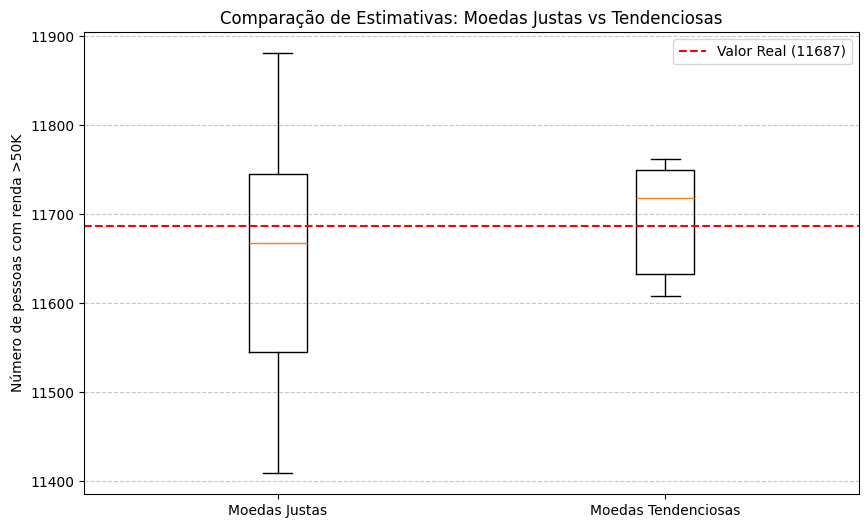
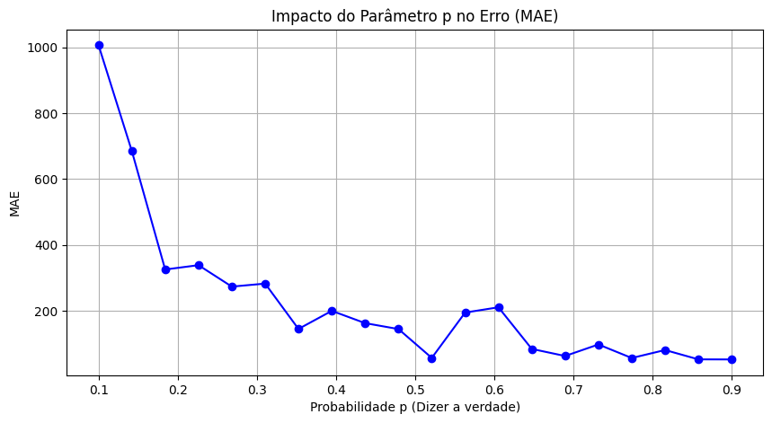
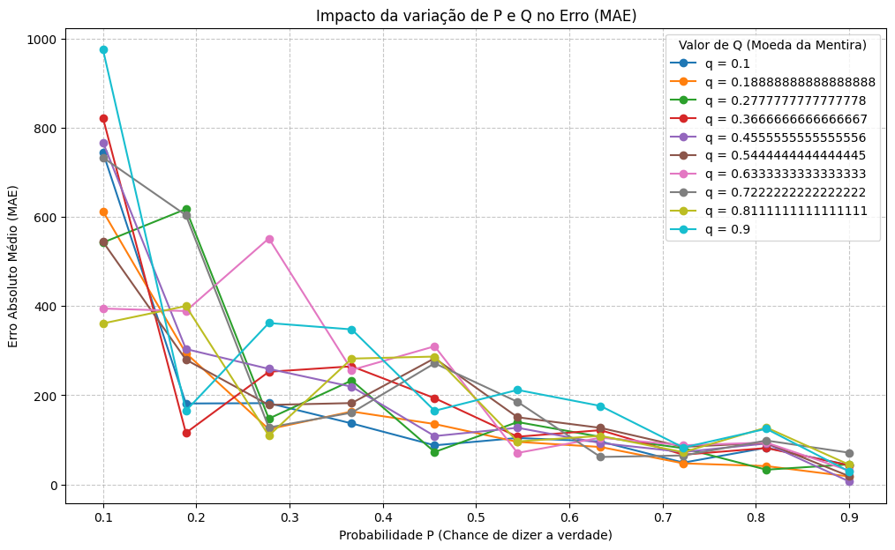
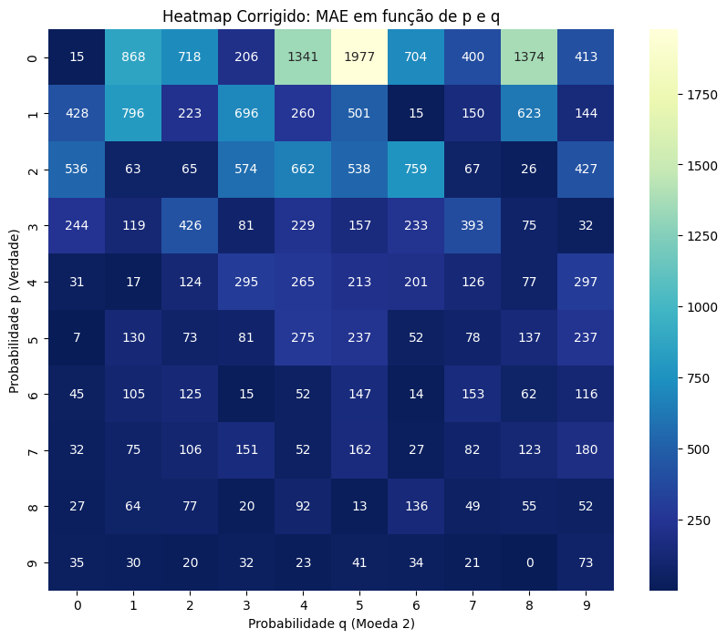
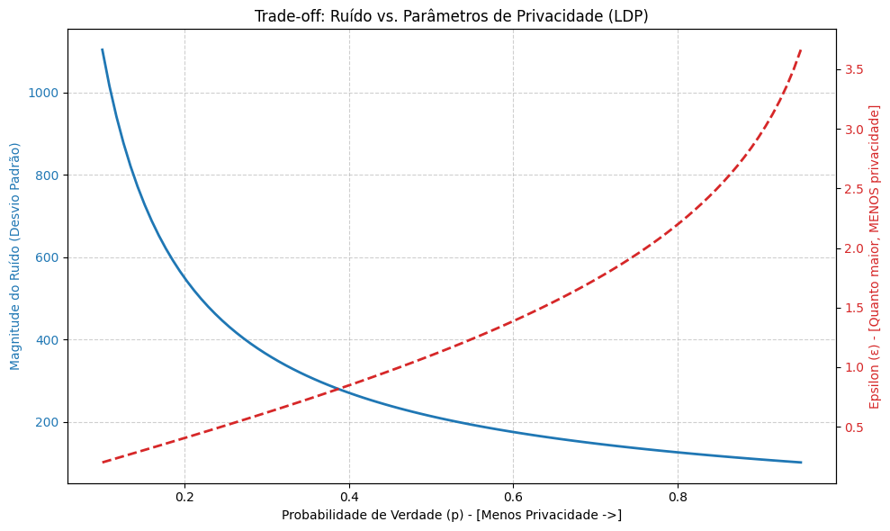

# Relatório Técnico: Mecanismo de Randomized Response
**Disciplina:** Privacidade de Dados – 2025  
**Trabalho 7:** Mecanismo Randomized Response (Privacidade Diferencial Local)  

---

## 1. Objetivo
O objetivo deste trabalho é implementar e analisar o algoritmo de **Randomized Response (RR)** em Python, comparando as variações de **moedas justas** e **moedas tendenciosas**. A análise foca em estimar a volumetria de indivíduos com renda superior a \$50K, avaliando o impacto dos parâmetros de probabilidade na precisão dos dados (utilidade) e na proteção da identidade (privacidade).

## 2. Modelagem Matemática e Algoritmo
O algoritmo de Randomized Response baseia-se em dois estágios de aleatoriedade para garantir a "denegabilidade plausível" do usuário:
1.  **Lançamento da Moeda 1 ($p$):** Define a chance de o usuário responder a verdade.
2.  **Lançamento da Moeda 2 ($q$):** Se a primeira moeda falhar, esta define se a resposta será "Sim" ou "Não" aleatoriamente.

### 2.1 Dedução do Estimador Não-Tendencioso ($\hat{T}_t$)
Para recuperar o valor real ($T$) a partir das respostas perturbadas ($S$), derivamos matematicamente o estimador desenviesado. Considerando $n$ como o total de registros:
$$E[S] = n \cdot [p \cdot \frac{T}{n} + (1 - p) \cdot q]$$
Isolando $T$, obtemos a fórmula implementada no projeto:
$$\hat{T}_t = \frac{S - n(1 - p)q}{p}$$

---

## 3. Análise Experimental

### 3.1 Comparação de Modelos: Moedas Justas vs. Tendenciosas
Para este teste, comparamos o modelo Justo ($p=0.5, q=0.5$) com o Tendencioso ($p=0.8, q=0.2$).

**["Comparação de Estimativas: Moedas Justas vs Tendenciosas" (Boxplot)]**

**Análise:** O gráfico demonstra que ambos os métodos convergem para o valor real (**11.687**). No entanto, as **Moedas Justas** apresentam uma dispersão muito maior (caixa mais alta), indicando que cada execução individual pode variar significativamente. As **Moedas Tendenciosas** reduzem essa variância, oferecendo uma estimativa muito mais estável e próxima do real.

### 3.2 Comportamento do Erro (MAE) em relação a $p$
Analisamos como o Erro Absoluto Médio (MAE) se comporta conforme aumentamos a probabilidade de verdade ($p$).

**["Impacto do Parâmetro p no Erro (MAE)" (Linha Azul)]**

**Análise:** Observa-se uma queda drástica no erro conforme $p$ cresce. Com $p=0.1$, o erro ultrapassa 1.000 unidades, tornando o dado pouco útil. A partir de $p=0.6$, o erro estabiliza abaixo de 200, validando que níveis menores de ruído aumentam drasticamente a utilidade analítica do dataset.

### 3.3 Estabilidade do Estimador perante $q$
Testamos diversas combinações de $q$ (viés da mentira) para verificar se o estimador matemático é robusto.

**["Impacto da variação de P e Q no Erro (MAE)" (Múltiplas Linhas)]**

**Análise:** O gráfico mostra que, independentemente do valor de $q$, todas as linhas convergem para o erro zero conforme $p$ aumenta. Isso comprova que a **fórmula de desenviesamento** está correta, pois ela compensa matematicamente qualquer viés introduzido pela segunda moeda.

---
#### **4 Análise de Sensibilidade Multivariada (p e q)**
**[Análise heatmap]**

**Explicação dos Resultados:**
"Através do Heatmap de Erro Absoluto Médio (MAE), analisamos a interação entre a probabilidade da primeira moeda ($p$) e da segunda moeda ($q$). 
*   **Efeito de $p$:** Observa-se que as zonas de menor erro (cores mais claras/frias) concentram-se no topo do gráfico (onde $p \to 0.9$). Isso confirma que a primeira moeda é o principal fator de utilidade do modelo.
*   **Efeito de $q$:** O parâmetro $q$ (viés da resposta aleatória) tem impacto reduzido na precisão final, uma vez que o estimador matemático consegue compensar estatisticamente o ruído inserido por essa moeda. No entanto, o erro é minimizado quando $q$ se aproxima da proporção real do dataset, embora o uso de $q=0.5$ seja preferível para manter a neutralidade e a denegabilidade plausível do mecanismo."

---
## 4. Discussão: Trade-off Privacidade vs. Utilidade
O gráfico de trade-off abaixo resume o desafio central da Privacidade Diferencial Local.

**["Trade-off: Ruído vs. Parâmetros de Privacidade (LDP)" (Epsilon e Ruído)]**

**Discussão Técnica:**
*   **Utilidade (Linha Azul - Ruído):** Representa o erro. Quando $p$ é alto (lado direito), o ruído é baixo e a utilidade é máxima.
*   **Privacidade (Linha Vermelha - Epsilon $\epsilon$):** Representa o nível de exposição. Um $\epsilon$ baixo (lado esquerdo) significa alta privacidade. 
*   **Conclusão:** Ao escolhermos o modelo tendencioso ($p=0.8$), optamos propositalmente por um $\epsilon$ mais alto ($\approx 2.5$) para obter um ruído baixo ($\approx 150$). Esta é uma escolha de projeto que prioriza a precisão estatística sobre o dataset Adult sem remover completamente a proteção individual.

---

## 5. Conclusão Geral
O trabalho demonstra que o mecanismo de Randomized Response é uma técnica poderosa para equilibrar as necessidades de analistas de dados e a privacidade de indivíduos. Através dos experimentos, ficou claro que:
1.  O estimador matemático é capaz de remover o viés de moedas tendenciosas com precisão.
2.  Aumentar a probabilidade $p$ melhora a utilidade, mas degrada o nível de privacidade ($\epsilon$).
3.  Para o *Adult Income Dataset*, o uso de moedas tendenciosas ($p=0.8$) mostrou-se o equilíbrio mais eficiente entre erro amostral e proteção de dados.

---
